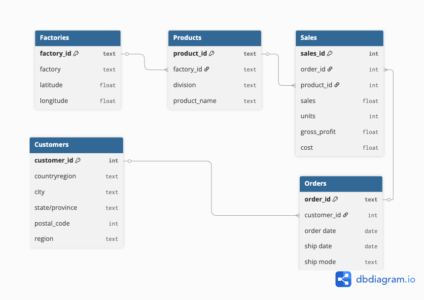

# 🍫 Wonka Factory SQL Project

## 📌 Project Overview

- This project analyzes sales, profitability, shipping, and customer behavior for the Wonka Factory using SQL. 
- The goal is to design a relational database and run analytical queries that support business decisions across marketing, products, and customer strategy.

## 🔍 Key Analyses

- Sales vs profit margin by region (Marketing)

- Product performance across products

- Profit concentration among customers (Customer Strategy)

## 📊 Business Insights

- High sales volume in a region does not always imply high profitability 

- High sales volume of a product type does not always imply high profitability

- A small group of customers contributes a large share of profit 

## 🗂️ Dataset

Provided dataset that includes:

- Orders and shipping details

- Products and factories

- Customers and regions

- Sales, cost, and profit metrics

## 🏗️ Database Design

The database is normalized to reduce redundancy and improve data integrity

Key tables include:

- products

- factories

- customers

- orders

- Bridge table, sales, to handle many-to-many relationships

An ERD is included to visualize the schema:



## 📁 Repository Structure

```text
SQL-project-willy-wonka-bain-and-co/
│
├── data/                     # Raw and cleaned datasets; output from the SQL queries used for analysis 
│
├── plots/                    # ERD Diagram, all charts and visualisations
│
├── notebooks/                # Jupyter notebooks for data exploration + EDA 
│
├── sql/                      # SQL queries for the hypothesis
│
└── README.md                 # Project documentation
```

## 🔗 Project Presentation:
[Click here to view the Presentation](https://www.canva.com/design/DAG7BwzGbXM/dBh_EeMOEuMtqFE6VMiXIQ/edit)